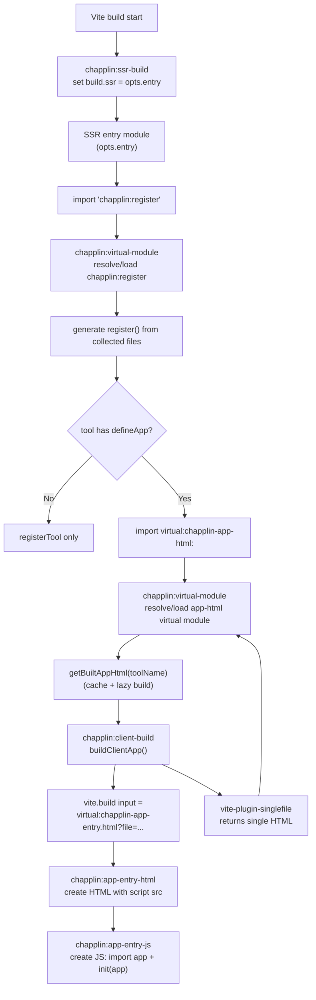
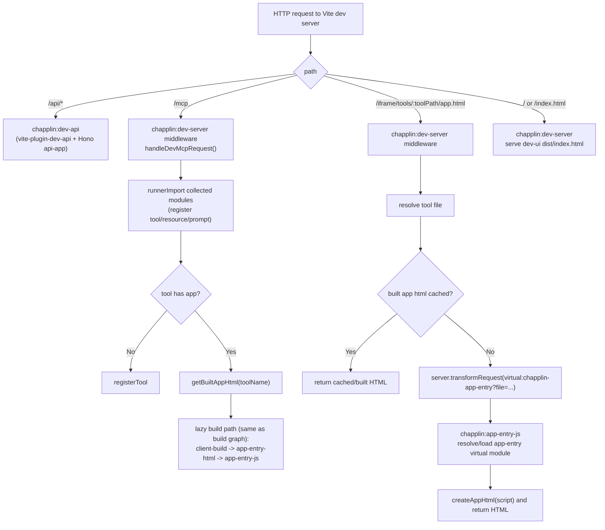

# Vite plugin for Chapplin

## Plugin order (`chapplin()`)

```ts
[
  ssrBuild,        // build only
  fileCollector,
  virtualModule,
  ...appEntry,
  clientBuild,
  typeGeneration,
  ...devServer,    // serve only
]
```

## Virtual modules

| Virtual module ID | Resolved by plugin | Main use | Mode |
| --- | --- | --- | --- |
| `chapplin:register` | `chapplin:virtual-module` | Generate `register(server)` for tools/resources/prompts | dev/build |
| `virtual:chapplin-app-html:<toolName>` | `chapplin:virtual-module` | Provide built app HTML string for `defineApp` tools | dev/build |
| `virtual:chapplin-app-entry?file=...` | `chapplin:app-entry-js` | Generate runtime JS (`init(app)`) for a tool app | dev/build |
| `virtual:chapplin-app-entry.html?file=...&lang.html` | `chapplin:app-entry-html` | Generate HTML shell that loads app-entry JS | build (and internal dev fallback path) |

## Build flow



## Dev flow



### Note

- `chapplin:register` is resolved by `chapplin:virtual-module` in both dev/build when the user entry imports it.
- In dev, `/mcp` registration path mainly uses `runnerImport` directly; app HTML generation still goes through `getBuiltAppHtml()` and the app-entry virtual modules.
